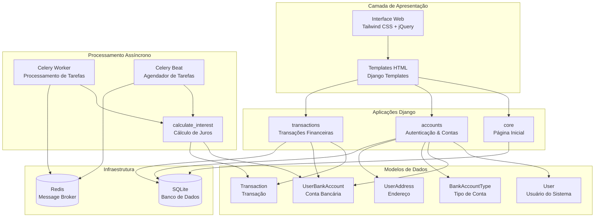
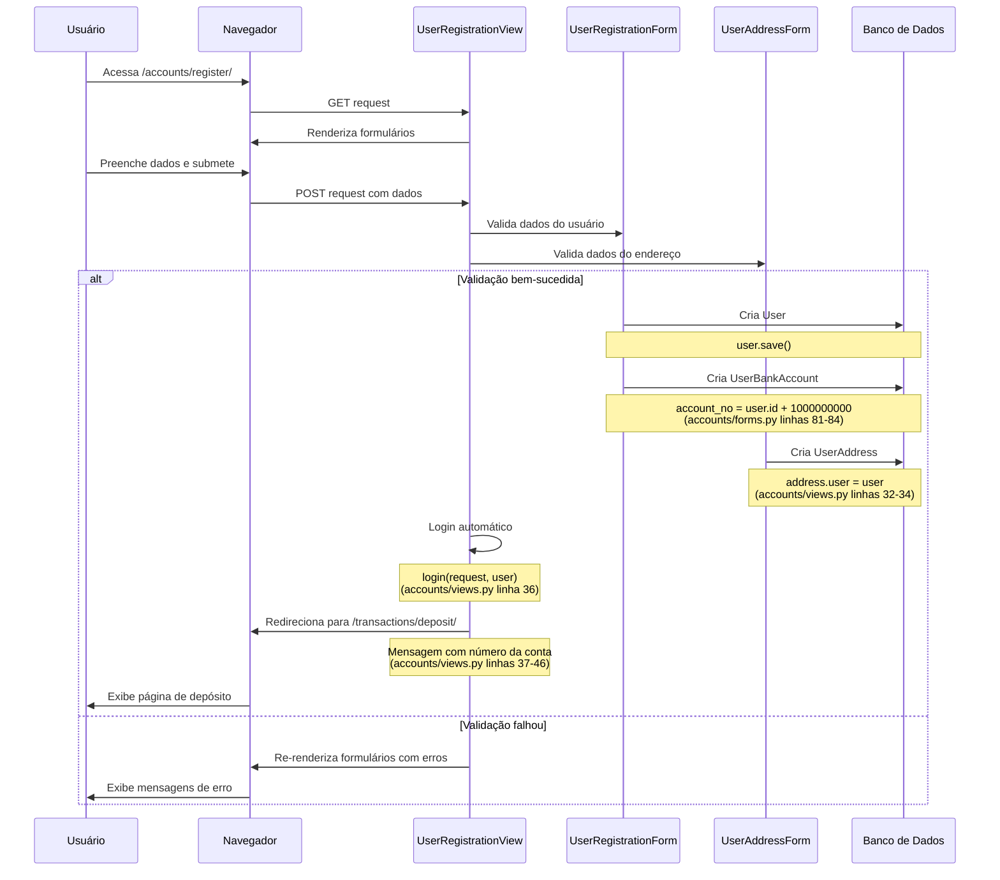
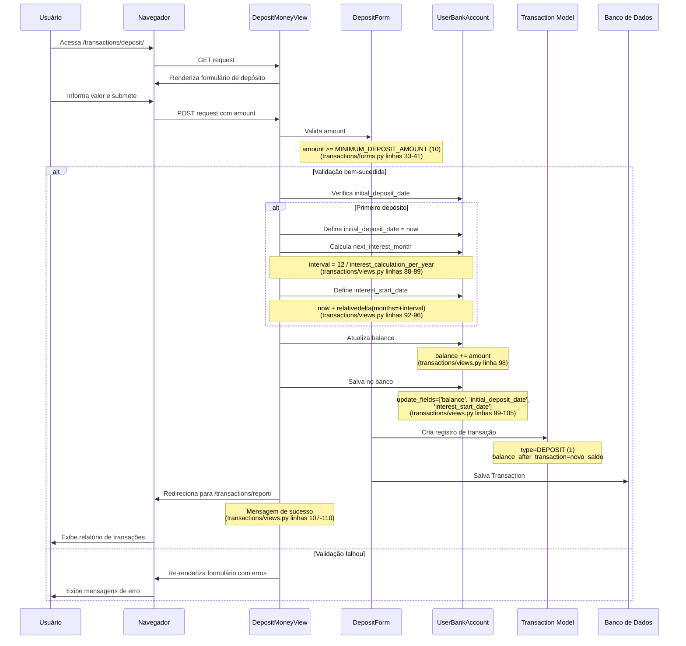
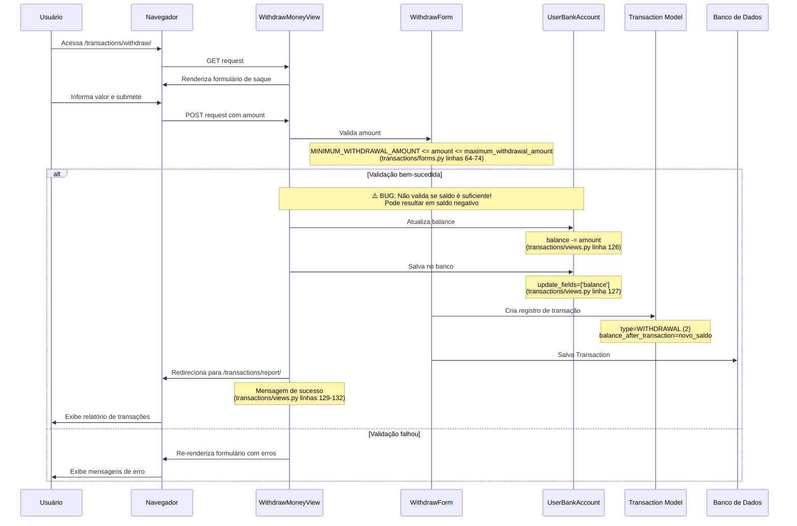
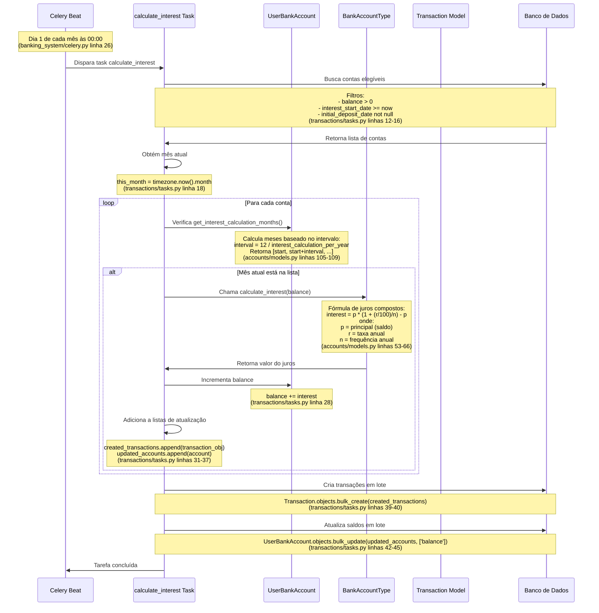

# Documentação de Arquitetura End-to-End do Sistema Bancário

**Versão:** 2.0.2  
**Descrição:** Sistema bancário web completo construído com Django para gerenciamento de contas, transações financeiras e cálculo automático de juros.

---

## 1. Arquitetura Geral do Sistema

O sistema bancário é construído em uma arquitetura em camadas com processamento assíncrono para tarefas agendadas.



### Componentes Principais

#### Camada de Apresentação
- **Interface Web**: Desenvolvida com Tailwind CSS para estilização moderna e responsiva
- **JavaScript**: jQuery e daterangepicker.js para interatividade
- **Templates Django**: Estrutura de templates organizada em `templates/` com base, navbar, footer e mensagens

#### Aplicações Django

**core** (`core/`)
- Gerencia a página inicial do sistema
- View: `HomeView` renderiza `core/index.html` (core/views.py linha 4-5)
- URL: `/` (banking_system/urls.py linha 23)

**accounts** (`accounts/`)
- Gerencia autenticação de usuários e contas bancárias
- Autenticação por email ao invés de username (accounts/models.py linha 20)
- Views: `UserRegistrationView`, `UserLoginView`, `LogoutView`
- URLs: `/accounts/register/`, `/accounts/login/`, `/accounts/logout/` (accounts/urls.py)

**transactions** (`transactions/`)
- Processa depósitos, saques e relatórios de transações
- Views: `DepositMoneyView`, `WithdrawMoneyView`, `TransactionRepostView`
- URLs: `/transactions/deposit/`, `/transactions/withdraw/`, `/transactions/report/` (transactions/urls.py)

#### Modelos de Dados

**User** (accounts/models.py linhas 14-30)
- Estende `AbstractUser` do Django
- Usa email como identificador único ao invés de username
- Propriedade `balance` retorna o saldo da conta associada

**BankAccountType** (accounts/models.py linhas 33-66)
- Define tipos de conta (Poupança, Corrente, etc.)
- Armazena taxa de juros anual e frequência de cálculo
- Método `calculate_interest()` implementa fórmula de juros compostos

**UserBankAccount** (accounts/models.py linhas 69-109)
- Relacionamento OneToOne com User
- Campos: `account_no`, `gender`, `birth_date`, `balance`
- Campos de controle: `initial_deposit_date`, `interest_start_date`
- Método `get_interest_calculation_months()` retorna meses para cálculo de juros

**UserAddress** (accounts/models.py linhas 112-124)
- Relacionamento OneToOne com User
- Armazena endereço completo do usuário

**Transaction** (transactions/models.py linhas 7-30)
- Registra todas as transações financeiras
- Tipos: DEPOSIT (1), WITHDRAWAL (2), INTEREST (3) (transactions/constants.py)
- Armazena `amount` e `balance_after_transaction`
- Ordenação por timestamp (mais antiga primeiro)

#### Processamento Assíncrono

**Celery Worker**
- Processa tarefas assíncronas
- Configuração em banking_system/celery.py
- Broker: Redis em localhost:6379 (banking_system/settings.py linha 137)

**Celery Beat**
- Agendador de tarefas periódicas
- Configurado para executar `calculate_interest` mensalmente
- Agendamento: Dia 1 de cada mês às 00:00 (banking_system/celery.py linha 26)

**Task calculate_interest** (transactions/tasks.py linhas 10-45)
- Calcula e aplica juros para todas as contas elegíveis
- Utiliza operações em lote (`bulk_create`, `bulk_update`) para eficiência

#### Infraestrutura

**Redis**
- Message Broker para Celery
- Backend de resultados para tarefas assíncronas
- Configurado em localhost:6379

**SQLite**
- Banco de dados de desenvolvimento
- Arquivo: `db.sqlite3` no diretório raiz

---

## 2. Fluxos Principais

### 2.1 Fluxo de Registro de Usuário



**Detalhes da Implementação:**

- **Endpoint**: `/accounts/register/` (accounts/urls.py linha 18)
- **View**: `UserRegistrationView` (accounts/views.py linhas 14-61)
- **Forms**: `UserRegistrationForm`, `UserAddressForm` (accounts/forms.py)

**Lógica de Criação de Conta:**
1. O número da conta é calculado automaticamente: `account_no = user.id + ACCOUNT_NUMBER_START_FROM` (accounts/forms.py linhas 81-84)
2. `ACCOUNT_NUMBER_START_FROM = 1000000000` (banking_system/settings.py linha 129)
3. A transação é atômica usando `@transaction.atomic` (accounts/forms.py linha 66)

**Pós-Registro:**
- Login automático do usuário (accounts/views.py linha 36)
- Mensagem de sucesso com número da conta (accounts/views.py linhas 37-42)
- Redirecionamento para página de depósito inicial (accounts/views.py linha 45)

---

### 2.2 Fluxo de Depósito



**Detalhes da Implementação:**

- **Endpoint**: `/transactions/deposit/` (transactions/urls.py linha 10)
- **View**: `DepositMoneyView` (transactions/views.py linhas 74-112)
- **Form**: `DepositForm` (transactions/forms.py)

**Validações:**
- Valor mínimo de depósito: `MINIMUM_DEPOSIT_AMOUNT = 10` (banking_system/settings.py linha 130)
- Validação em `DepositForm.clean_amount()` (transactions/forms.py linhas 33-41)

**Lógica de Primeiro Depósito:**
1. Verifica se `initial_deposit_date` é nulo (transactions/views.py linha 86)
2. Define `initial_deposit_date` como data/hora atual (transactions/views.py linha 91)
3. Calcula próximo mês de juros baseado na frequência anual (transactions/views.py linhas 88-89)
4. Define `interest_start_date` usando relativedelta (transactions/views.py linhas 92-96)

**Atualização de Saldo:**
- Incrementa o saldo: `balance += amount` (transactions/views.py linha 98)
- Salva com campos específicos para otimização (transactions/views.py linhas 99-105)

---

### 2.3 Fluxo de Saque



**Detalhes da Implementação:**

- **Endpoint**: `/transactions/withdraw/` (transactions/urls.py linha 12)
- **View**: `WithdrawMoneyView` (transactions/views.py linhas 115-134)
- **Form**: `WithdrawForm` (transactions/forms.py)

**Validações:**
- Valor mínimo: `MINIMUM_WITHDRAWAL_AMOUNT = 10` (banking_system/settings.py linha 131)
- Valor máximo: `maximum_withdrawal_amount` do tipo de conta (transactions/forms.py linha 64)
- Validação em `WithdrawForm.clean_amount()` (transactions/forms.py linhas 64-74)

**⚠️ Bug Conhecido:**
- **Descrição**: O sistema não valida se o saldo é suficiente antes de processar o saque
- **Consequência**: Permite saques que resultam em saldo negativo
- **Localização**: transactions/views.py linha 126 - decrementa o saldo sem verificação prévia
- **Impacto**: Contas podem ficar com saldo negativo, violando regras de negócio bancárias

**Atualização de Saldo:**
- Decrementa o saldo: `balance -= amount` (transactions/views.py linha 126)
- Salva apenas o campo balance (transactions/views.py linha 127)

---

### 2.4 Fluxo de Cálculo de Juros



**Detalhes da Implementação:**

- **Task**: `calculate_interest` (transactions/tasks.py linhas 10-45)
- **Agendamento**: Celery Beat - crontab dia 1, hora 0, minuto 0 (banking_system/celery.py linha 26)
- **Configuração**: beat_schedule em banking_system/celery.py linhas 22-28

**Critérios de Elegibilidade:**
1. `balance > 0` - conta deve ter saldo positivo
2. `interest_start_date >= timezone.now()` - data de início de juros já passou
3. `initial_deposit_date is not null` - conta teve pelo menos um depósito
4. Mês atual deve estar na lista de meses de cálculo da conta

(transactions/tasks.py linhas 12-16, linha 24)

**Cálculo de Juros:**

**Fórmula Implementada** (accounts/models.py linhas 53-66):
```
interest = principal × (1 + (annual_rate/100) / n) - principal
```

Onde:
- `principal` = saldo atual da conta
- `annual_rate` = taxa de juros anual do tipo de conta (%)
- `n` = frequência de cálculo anual (quantas vezes por ano)

**Exemplo:**
- Saldo: R$ 1.000,00
- Taxa anual: 12%
- Frequência: 12 vezes/ano (mensal)
- Juros: 1000 × (1 + (12/100)/12) - 1000 = R$ 10,00

**Meses de Cálculo** (accounts/models.py linhas 99-109):
- Calcula intervalo: `interval = 12 / interest_calculation_per_year`
- Gera lista de meses começando em `interest_start_date.month`
- Exemplo com cálculo bimestral (n=6): [2, 4, 6, 8, 10, 12]

**Otimização de Performance:**
- Usa `select_related('account_type')` para evitar queries N+1 (transactions/tasks.py linha 16)
- Cria transações em lote com `bulk_create` (transactions/tasks.py linha 40)
- Atualiza contas em lote com `bulk_update` (transactions/tasks.py linhas 43-45)
- Acumula objetos em listas antes das operações de banco (transactions/tasks.py linhas 20-37)

**Tipo de Transação:**
- Cria Transaction com `transaction_type=INTEREST` (3) (transactions/tasks.py linha 33)
- Registra o valor dos juros creditados

---

## 3. Stack Tecnológica

### Backend
- **Django 3.2** - Framework web Python
- **Python ≥ 3.7** - Linguagem de programação
- **django-celery-beat** - Integração Django com Celery Beat

### Processamento Assíncrono
- **Celery 4.4.7** - Framework de tarefas distribuídas
- **Redis 3.5.3** - Message broker e backend de resultados

### Frontend
- **Tailwind CSS** - Framework CSS utilitário
- **jQuery** - Biblioteca JavaScript
- **daterangepicker.js** - Seletor de intervalos de data

### Banco de Dados
- **SQLite** - Banco de dados relacional (desenvolvimento)
- Arquivo: `db.sqlite3` no diretório raiz

### Gerenciamento de Dependências
- **requirements.txt** - Dependências Python

---

## 4. Funcionalidades Principais

### Autenticação e Contas
- ✅ Autenticação por email ao invés de username
- ✅ Registro de usuário com criação automática de conta bancária
- ✅ Geração automática de número de conta
- ✅ Suporte a múltiplos tipos de conta (Poupança, Corrente)
- ✅ Login e logout seguros
- ✅ Redirecionamento automático para depósito inicial após registro

### Transações Financeiras
- ✅ Depósito com validação de valor mínimo
- ✅ Saque com validação de limites mínimo e máximo
- ⚠️ **Bug**: Saque permite saldo negativo
- ✅ Registro detalhado de todas as transações
- ✅ Cálculo de saldo após cada transação

### Cálculo de Juros
- ✅ Cálculo automático mensal de juros compostos
- ✅ Diferentes taxas e frequências por tipo de conta
- ✅ Definição automática de data de início de juros
- ✅ Cálculo apenas para contas com saldo positivo
- ✅ Processamento em lote para eficiência

### Relatórios
- ✅ Relatório completo de transações
- ✅ Filtro por período de datas
- ✅ Exibição de saldo atual
- ✅ Histórico ordenado por data

### Interface do Usuário
- ✅ Design moderno e responsivo com Tailwind CSS
- ✅ Mensagens de feedback para o usuário
- ✅ Navegação intuitiva
- ✅ Formulários com validação

---

## 5. Informações Adicionais

### Processos Necessários

O sistema requer **três processos** rodando simultaneamente para operação completa:

1. **Django Development Server**
   ```bash
   python manage.py runserver
   ```
   - Serve a aplicação web
   - Porta padrão: 8000

2. **Celery Worker**
   ```bash
   celery -A banking_system worker -l info
   ```
   - Processa tarefas assíncronas
   - Executa a task `calculate_interest`

3. **Celery Beat**
   ```bash
   celery -A banking_system beat -l info
   ```
   - Agendador de tarefas periódicas
   - Dispara `calculate_interest` mensalmente

### Script de Dados de Demonstração

O sistema inclui um script para criar dados de demonstração:

**Arquivo**: `create_demo_data.py`

**Funcionalidade**:
- Cria usuário de demonstração: `demo@example.com`
- Popula o banco com dados de exemplo
- Útil para testes e desenvolvimento

### Configurações Importantes

**Valores Padrão** (banking_system/settings.py):
- `ACCOUNT_NUMBER_START_FROM = 1000000000` (linha 129)
- `MINIMUM_DEPOSIT_AMOUNT = 10` (linha 130)
- `MINIMUM_WITHDRAWAL_AMOUNT = 10` (linha 131)
- `LOGIN_REDIRECT_URL = 'home'` (linha 134)

**Celery** (banking_system/settings.py linhas 136-142):
- Broker: `redis://localhost:6379`
- Backend de resultados: `redis://localhost:6379`
- Formato de serialização: JSON
- Timezone: UTC

### Modelo de Usuário Customizado

O sistema utiliza um modelo de usuário customizado:
- `AUTH_USER_MODEL = 'accounts.User'` (banking_system/settings.py linha 59)
- Remove campo `username`
- Usa `email` como identificador único
- Gerenciado por `UserManager` customizado

### URLs da Aplicação

**URLs Principais**:
- `/` - Página inicial (core)
- `/accounts/register/` - Registro de usuário
- `/accounts/login/` - Login
- `/accounts/logout/` - Logout
- `/transactions/deposit/` - Depósito
- `/transactions/withdraw/` - Saque
- `/transactions/report/` - Relatório de transações
- `/admin/` - Interface administrativa Django

---

## 6. Problemas Conhecidos

### Bug: Saldo Negativo em Saques

**Descrição**: O sistema não valida se o saldo da conta é suficiente antes de processar um saque.

**Localização**: `transactions/views.py` linha 126

**Código Problemático**:
```python
self.request.user.account.balance -= form.cleaned_data.get('amount')
```

**Consequência**: 
- Usuários podem sacar valores maiores que o saldo disponível
- Contas podem ficar com saldo negativo
- Viola regras de negócio bancárias

**Validações Existentes**:
- ✅ Valor mínimo de saque
- ✅ Valor máximo de saque (por tipo de conta)
- ❌ Saldo suficiente (FALTANDO)

**Solução Recomendada**: 
Adicionar validação no `WithdrawForm.clean_amount()` ou no `WithdrawMoneyView.form_valid()` para verificar se `amount <= account.balance` antes de processar o saque.

---

## 7. Diagramas de Relacionamento

### Relacionamentos entre Modelos

```
User (1) ─────────── (1) UserBankAccount
                           │
                           │ (many)
                           ├────────── Transaction
                           │
                           └────────── (1) BankAccountType
                                       
User (1) ─────────── (1) UserAddress
```

**Relacionamentos**:
1. User ↔ UserBankAccount: OneToOne (related_name='account')
2. User ↔ UserAddress: OneToOne (related_name='address')
3. UserBankAccount ↔ Transaction: ForeignKey (related_name='transactions')
4. UserBankAccount ↔ BankAccountType: ForeignKey (related_name='accounts')

---

## Conclusão

Este sistema bancário oferece uma arquitetura robusta e escalável para operações bancárias básicas. A combinação de Django para o backend web, Celery para processamento assíncrono, e Redis como message broker proporciona uma base sólida para operações financeiras. A interface moderna com Tailwind CSS garante uma boa experiência do usuário.

O principal ponto de atenção é o bug de validação de saldo em saques, que deve ser corrigido antes de qualquer uso em produção. Além disso, para ambientes de produção, recomenda-se:
- Migrar de SQLite para PostgreSQL ou MySQL
- Implementar autenticação de dois fatores
- Adicionar logs detalhados de auditoria
- Implementar rate limiting para proteção contra abuso
- Adicionar testes automatizados abrangentes
- Configurar monitoramento e alertas
