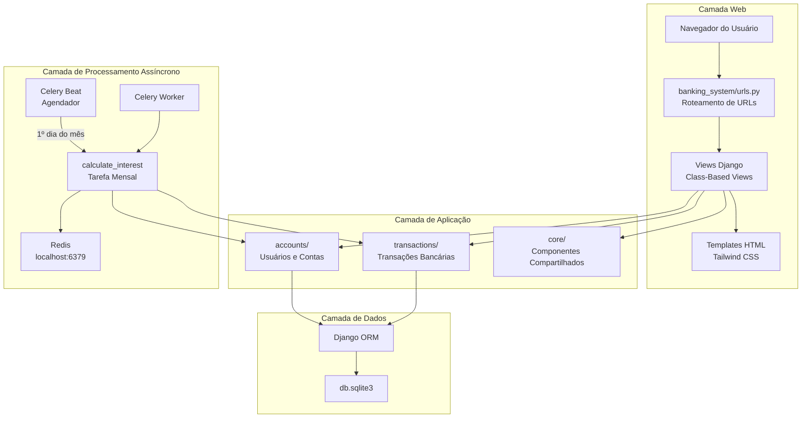
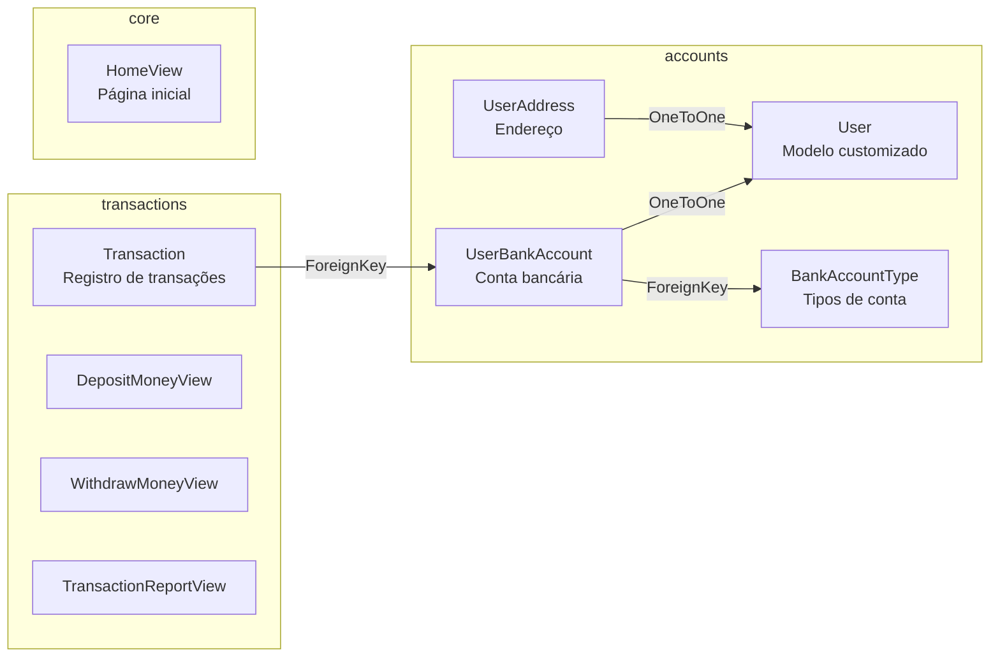
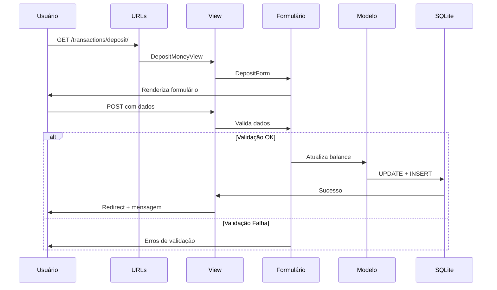
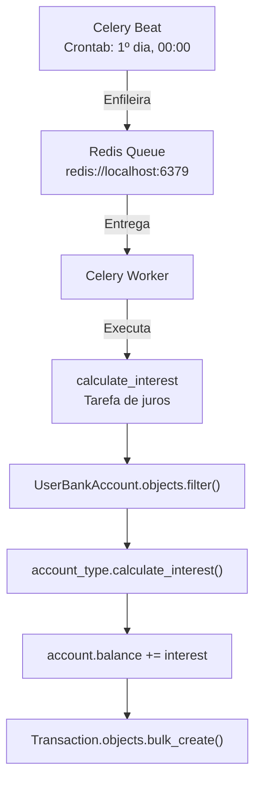
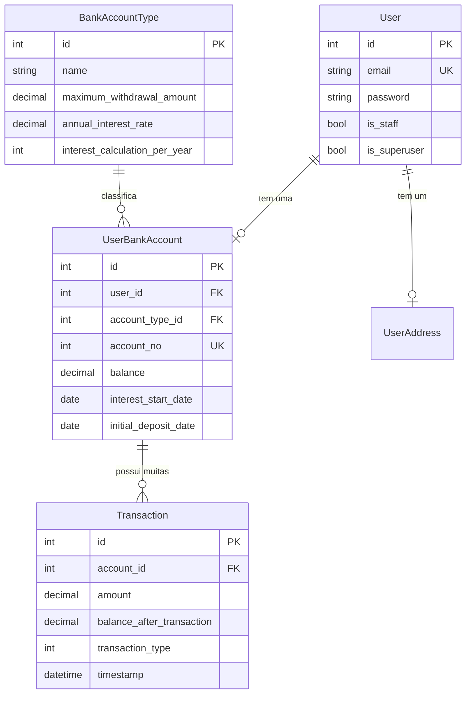
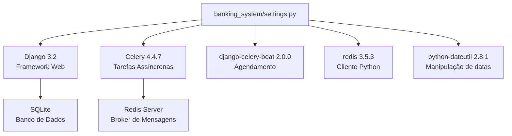

# DOCUMENTAÇÃO - Sistema Bancário Django

## 1. Visão Geral do Projeto

Este é um **sistema bancário online** criado com **Django Web Framework versão 3.2**, desenvolvido para **fins educacionais e de demonstração**, não devendo ser utilizado em produção.

O projeto é parte do repositório `cognition-workshop/sistema-banco`, indicando seu uso em **workshops de aprendizado** sobre desenvolvimento web, segurança de aplicações e boas práticas de programação.

### Características Principais

- Sistema de contas bancárias com tipos diferentes (Poupança e Corrente)
- Operações de depósito e saque
- Relatório de transações com filtro por data
- Cálculo automático de juros mensais via Celery
- Interface moderna com Tailwind CSS
- **Usuário demo pré-configurado** para facilitar testes: `demo@example.com` com senha `demo123`

### Propósito Educacional

O sistema serve como material didático para:
- Demonstrar vulnerabilidades comuns em aplicações web
- Ensinar conceitos de autenticação e autorização
- Ilustrar processamento assíncrono com Celery
- Mostrar integração com Redis como message broker
- Exemplificar padrões MVT (Model-View-Template) do Django

## 2. Rotas da Aplicação

A aplicação possui apenas **rotas Web** (não há APIs REST/GraphQL). Todas as rotas servem páginas HTML renderizadas pelo Django.

### 2.1 Rotas Principais (Root)

| Rota | View | Descrição |
|------|------|-----------|
| `/` | HomeView | Página inicial do sistema |
| `/admin/` | Django Admin | Interface administrativa do Django |
| `/accounts/*` | (delegado) | Rotas de autenticação de usuários |
| `/transactions/*` | (delegado) | Rotas de transações bancárias |

**Referência:** `banking_system/urls.py` linhas 22-28

### 2.2 Rotas de Contas (`/accounts/`)

| Rota | View | Descrição |
|------|------|-----------|
| `/accounts/login/` | UserLoginView | Formulário de login de usuário |
| `/accounts/logout/` | LogoutView | Logout de usuário autenticado |
| `/accounts/register/` | UserRegistrationView | Formulário de registro de novo usuário |

**Referência:** `accounts/urls.py` linhas 8-20

### 2.3 Rotas de Transações (`/transactions/`)

| Rota | View | Descrição |
|------|------|-----------|
| `/transactions/deposit/` | DepositMoneyView | Formulário de depósito de dinheiro |
| `/transactions/withdraw/` | WithdrawMoneyView | Formulário de saque de dinheiro |
| `/transactions/report/` | TransactionRepostView | Relatório de transações com filtros |

**Referência:** `transactions/urls.py` linhas 9-12

## 3. Requisitos de Acesso por Rota

### 3.1 Rotas Públicas (Sem Autenticação)

As seguintes rotas são acessíveis sem autenticação:

| Rota | Observações |
|------|-------------|
| `/` | Página inicial pública |
| `/accounts/login/` | Redireciona para transaction report se já autenticado |
| `/accounts/register/` | Redireciona para transaction report se já autenticado |

**Referência:** `accounts/views.py` linhas 19-23 (método `dispatch` verifica se usuário já está autenticado)

### 3.2 Rotas de Transações (Sistema Demo)

**⚠️ IMPORTANTE - VULNERABILIDADE CRÍTICA:**

As rotas de transações atualmente utilizam um **sistema de usuário demo que NÃO requer autenticação**. Qualquer pessoa pode acessar estas rotas sem fazer login:

| Rota | Comportamento Atual |
|------|---------------------|
| `/transactions/deposit/` | Usa usuário demo (`demo@example.com`) - **SEM AUTENTICAÇÃO** |
| `/transactions/withdraw/` | Usa usuário demo (`demo@example.com`) - **SEM AUTENTICAÇÃO** |
| `/transactions/report/` | Usa usuário demo (`demo@example.com`) - **SEM AUTENTICAÇÃO** |

**Referências:**
- `transactions/views.py` linhas 32-39 (comentário `# Bypass login - use demo user` em `TransactionRepostView.get_queryset`)
- `transactions/views.py` linhas 51-55 (comentário `# Bypass login - use demo user` em `TransactionRepostView.get_context_data`)
- `transactions/views.py` linhas 70-76 (comentário `# Bypass login - use demo user` em `TransactionCreateMixin.get_form_kwargs`)
- `transactions/views.py` linhas 98-103 (comentário `# Bypass login - use demo user` em `DepositMoneyView.form_valid`)
- `transactions/views.py` linhas 144-148 (comentário `# Bypass login - use demo user` em `WithdrawMoneyView.form_valid`)

As views de transações **não herdam de `LoginRequiredMixin`**, confirmando o bypass de autenticação:
- `TransactionRepostView` (linha 19): herda apenas de `ListView`
- `TransactionCreateMixin` (linha 62): herda apenas de `CreateView`

### 3.3 Rota Administrativa

| Rota | Requisitos |
|------|-----------|
| `/admin/` | Requer `is_staff=True` e `is_superuser=True` |

### 3.4 Sistema de Permissões

**Nota:** A aplicação **não utiliza grupos do Django** (`auth.Group`) para controle de acesso. O sistema de permissões é baseado apenas em:
- Status de autenticação (que está sendo ignorado nas rotas de transações)
- Flags do modelo User: `is_staff` e `is_superuser` (apenas para acesso ao admin)

## 4. Bibliotecas e Versões

### 4.1 Dependências Python

| Biblioteca | Versão | Propósito |
|------------|--------|-----------|
| Django | 3.2 | Framework web principal |
| celery | 4.4.7 | Processamento assíncrono de tarefas |
| django-celery-beat | 2.0.0 | Agendamento de tarefas periódicas do Celery |
| redis | 3.5.3 | Cliente Python para Redis (broker de mensagens) |
| python-dateutil | 2.8.1 | Utilitários para manipulação de datas |

**Referência:** README.md linhas 32-36

### 4.2 Pré-requisitos do Sistema

| Componente | Versão Mínima | Observações |
|------------|---------------|-------------|
| Python | >= 3.7 | Linguagem de programação |
| Redis Server | (qualquer) | Deve estar executando separadamente |
| Git | (qualquer) | Controle de versão |
| pip | (qualquer) | Gerenciador de pacotes Python |
| Virtualenv | (recomendado) | virtualenvwrapper é recomendado |

**Referência:** README.md linhas 24-28

## 5. Vulnerabilidades Identificadas

### 5.1 Vulnerabilidades de Código

#### 🔴 CRÍTICAS

**1. SECRET_KEY Exposta no Código**
- **Localização:** `banking_system/settings.py` linhas 22-23
- **Problema:** Chave secreta hardcoded diretamente no código-fonte
- **Código:**
  ```python
  SECRET_KEY = 'po0172$69b@78ps4v^uhfxu6q--8ko7kpp7rbz420s_3w#sir%'
  ```
- **Impacto:** Comprometimento total de:
  - Sessões de usuário
  - Tokens CSRF
  - Assinaturas criptográficas
  - Cookies de sessão
- **Recomendação:** Usar variáveis de ambiente (`os.environ.get('SECRET_KEY')`)

**2. Bypass de Autenticação**
- **Localização:** `transactions/views.py` linhas 19, 32-39, 51-55, 70-76, 98-103, 144-148
- **Problema:** Views de transações usam usuário demo fixo, ignorando completamente a autenticação
- **Código:**
  ```python
  # Bypass login - use demo user
  User = get_user_model()
  demo_user = User.objects.filter(email='demo@example.com').first()
  ```
- **Impacto:**
  - Qualquer pessoa pode acessar transações sem autenticação
  - Não há controle de acesso baseado em usuário
  - Violação completa dos princípios de autenticação e autorização
- **Recomendação:** Implementar autenticação adequada usando `LoginRequiredMixin`

#### 🟠 ALTAS

**3. DEBUG=True em Produção**
- **Localização:** `banking_system/settings.py` linhas 25-26
- **Problema:** Modo debug ativado permanentemente
- **Código:**
  ```python
  DEBUG = True
  ```
- **Impacto:**
  - Exposição de stack traces detalhados
  - Informações sensíveis visíveis em páginas de erro
  - Listagem de configurações do Django
  - Vazamento de caminhos de arquivos do servidor
- **Recomendação:** Usar `DEBUG = os.environ.get('DEBUG', 'False') == 'True'`

**4. Validação de Saldo Ausente**
- **Localização:** `transactions/forms.py` linhas 67-68
- **Problema:** Formulário de saque não valida se há saldo suficiente
- **Código:**
  ```python
  # TODO: Add validation to prevent negative balances
  # Bug: Users can currently withdraw more than their balance
  ```
- **Impacto:**
  - Usuários podem ter saldos negativos
  - Violação de regras de negócio bancárias
  - Inconsistências nos dados financeiros
- **Recomendação:** Adicionar validação:
  ```python
  if amount > balance:
      raise forms.ValidationError('Insufficient balance')
  ```

#### 🟡 MÉDIAS

**5. ALLOWED_HOSTS Vazio**
- **Localização:** `banking_system/settings.py` linha 28
- **Problema:** Lista de hosts permitidos está vazia
- **Código:**
  ```python
  ALLOWED_HOSTS = []
  ```
- **Impacto:**
  - Vulnerável a Host Header Injection
  - Permite acesso de qualquer domínio (apenas porque DEBUG=True)
  - Em produção com DEBUG=False, a aplicação não funcionaria
- **Recomendação:** Definir hosts específicos: `ALLOWED_HOSTS = ['exemplo.com', 'www.exemplo.com']`

**6. Credenciais Hardcoded**
- **Localização:** `create_demo_data.py` linha 46
- **Problema:** Senha do usuário demo exposta no código
- **Código:**
  ```python
  demo_user.set_password('demo123')
  ```
- **Impacto:**
  - Credenciais conhecidas publicamente
  - Qualquer pessoa pode fazer login como usuário demo
  - Senha fraca e previsível
- **Observação:** O usuário demo é criado com email `demo@example.com` e senha `demo123`

### 5.2 Vulnerabilidades de Bibliotecas

#### 🟠 ALTAS

**1. Django 3.2 Desatualizado**
- **Versão atual:** 3.2
- **Vulnerabilidades conhecidas:**
  - CVE-2023-43665 (Potential denial of service vulnerability in UsernameField)
  - CVE-2023-41164 (Potential denial of service vulnerability in django.utils.encoding.uri_to_iri)
  - CVE-2023-36053 (Potential ReDoS in EmailValidator and URLValidator)
- **Recomendação:** Atualizar para Django 3.2.25 (última versão da série 3.2 LTS) ou migrar para Django 4.2 LTS

#### 🟡 MÉDIAS

**2. Celery 4.4.7 Desatualizado**
- **Versão atual:** 4.4.7 (lançada em 2020)
- **Vulnerabilidades:**
  - CVE-2021-23727 (Stored Command Injection)
- **Recomendação:** Atualizar para Celery 5.x (versão mais recente e estável)

**3. Redis Client 3.5.3 Desatualizado**
- **Versão atual:** 3.5.3
- **Recomendação:** Atualizar para redis-py 4.x ou 5.x para correções de segurança e melhorias de performance

### 5.3 Configurações de Segurança Ausentes

As seguintes configurações de segurança do Django estão ausentes em `banking_system/settings.py`:

| Configuração | Propósito | Valor Recomendado |
|--------------|-----------|-------------------|
| `SECURE_SSL_REDIRECT` | Força redirecionamento HTTPS | `True` |
| `SESSION_COOKIE_SECURE` | Envia cookie de sessão apenas via HTTPS | `True` |
| `CSRF_COOKIE_SECURE` | Envia cookie CSRF apenas via HTTPS | `True` |
| `SECURE_HSTS_SECONDS` | HTTP Strict Transport Security | `31536000` (1 ano) |
| `X_FRAME_OPTIONS` | Proteção contra clickjacking | `'DENY'` |
| `SECURE_CONTENT_TYPE_NOSNIFF` | Previne MIME type sniffing | `True` |

### 5.4 Problemas de Infraestrutura

**SQLite em Produção**
- **Localização:** `banking_system/settings.py` linhas 83-87
- **Problema:** Uso de SQLite como banco de dados
- **Código:**
  ```python
  DATABASES = {
      'default': {
          'ENGINE': 'django.db.backends.sqlite3',
          'NAME': BASE_DIR / 'db.sqlite3',
      }
  }
  ```
- **Impacto:**
  - Não recomendado para produção
  - Sem suporte adequado para concorrência
  - Sem recursos de backup/replicação robustos
  - Limitações de escalabilidade
- **Recomendação:** Usar PostgreSQL ou MySQL em produção

## 6. Arquitetura do Projeto

### 6.1 Visão Geral das Camadas



### 6.2 Estrutura de Aplicações Django



### 6.3 Fluxo de Requisição HTTP



### 6.4 Sistema de Processamento Assíncrono (Celery)



**Referência:** `transactions/tasks.py` linhas 10-45

O sistema executa o cálculo de juros automaticamente no primeiro dia de cada mês às 00:00 UTC, aplicando juros compostos de acordo com o tipo de conta bancária.

### 6.5 Modelo de Dados (Relacionamentos)



**Referências:**
- `accounts/models.py` linhas 14-30 (User)
- `accounts/models.py` linhas 33-66 (BankAccountType)
- `accounts/models.py` linhas 69-109 (UserBankAccount)
- `accounts/models.py` linhas 112-124 (UserAddress)
- `transactions/models.py` linhas 7-30 (Transaction)

### 6.6 Configuração e Dependências



## 7. Notas Importantes

### Padrões e Convenções

- **Padrão MVT:** O projeto segue rigorosamente o padrão Model-View-Template do Django
- **Class-Based Views:** Todas as views utilizam CBVs (Class-Based Views) ao invés de function-based views
- **CSS Framework:** Interface construída com **Tailwind CSS** para estilização moderna e responsiva (README.md linha 17)

### Processamento Assíncrono

- **Cálculo de Juros:** Executado automaticamente via Celery Beat no **1º dia de cada mês às 00:00 UTC**
- **Tarefa:** `calculate_interest` definida em `transactions/tasks.py`
- **Broker:** Redis rodando em `localhost:6379`
- **Fórmula:** Juros compostos calculados com base no tipo de conta e saldo atual

### Sistema de Autenticação (Demo Mode)

- **⚠️ Ausência de LoginRequiredMixin:** As views de transações **não herdam de `LoginRequiredMixin`**, confirmando o bypass de autenticação
- **Navbar Hardcoded:** A barra de navegação exibe permanentemente **"Demo User: John Doe (Account #1001)"** (referência: `templates/core/navbar.html` linha 24)
- **Comentário no Template:** A linha 11 do navbar.html contém o comentário `{# Bypass authentication - always show navigation for demo #}`
- **Usuário Demo Fixo:** Todas as operações de transação são executadas usando o usuário `demo@example.com`

### Credenciais Demo

- **Email:** demo@example.com
- **Senha:** demo123
- **Número da Conta:** 1001
- **Tipo de Conta:** Savings Account
- **Saldo Inicial:** $5000.00

**Referência:** `create_demo_data.py` linhas 37-61

### Reconhecimento de Limitações

O arquivo `banking_system/settings.py` contém um comentário importante nas linhas 18-20:

```python
# Quick-start development settings - unsuitable for production
# See https://docs.djangoproject.com/en/3.1/howto/deployment/checklist/
```

Este comentário reconhece explicitamente que as configurações atuais são **inadequadas para produção**, reforçando o propósito educacional do projeto.

### Uso Recomendado

Este sistema deve ser utilizado exclusivamente para:
- ✅ Workshops e treinamentos de segurança
- ✅ Demonstrações de vulnerabilidades comuns
- ✅ Aprendizado de Django e desenvolvimento web
- ✅ Testes e experimentação em ambiente local

**❌ NÃO utilizar em produção ou com dados reais**

### Script de Dados Demo

O arquivo `create_demo_data.py` cria automaticamente:
- 2 tipos de contas bancárias (Savings e Current)
- 1 usuário demo completo com endereço
- 7 transações de exemplo (depósitos e saques)
- Saldo calculado corretamente após todas as transações

Para executar: `python create_demo_data.py`

---

**Documentação gerada para fins educacionais - Sistema Bancário Django v3.2**
